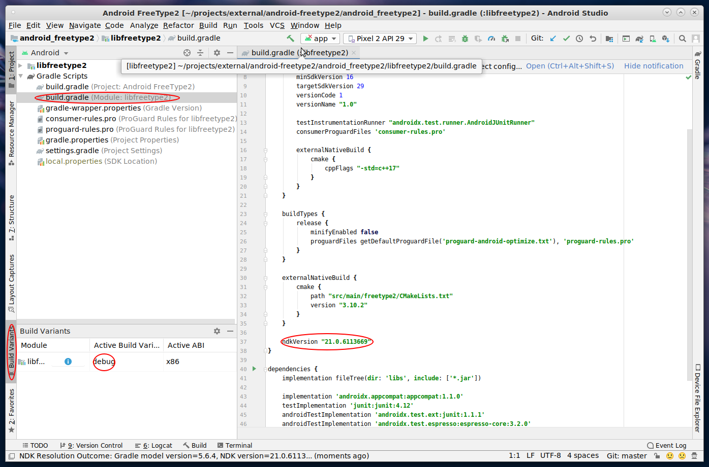

# Android FreeType2 Library 
This project builds an FreeType2 library for Android.

## Step 1: Android Studio Build
* Open this directory in Android Studio.
* Edit ndkVersion to match the one you have installed (~/Android/Sdk/ndk/...).
* Build debug.
  * Select 'Build Variants' then select debug.
  * In the 'Build' menu select 'Make Project' (Ctrl+F9).
* Build release.
  * Select 'Build Variants' then select release.
  * In the 'Build' menu select 'Make Project' (Ctrl+F9).
* This should result in 2 .arr files in: ```libfreetype2/build/outputs/aar```.



## Step 2: Gather Results
Now we want to gether the .arr's, libs, and includes ready for distribution.

* Run ./package_output.sh
* This will generate android-freetype2 and android-freetype2.tar.gz